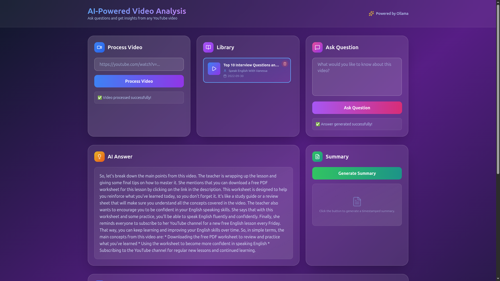
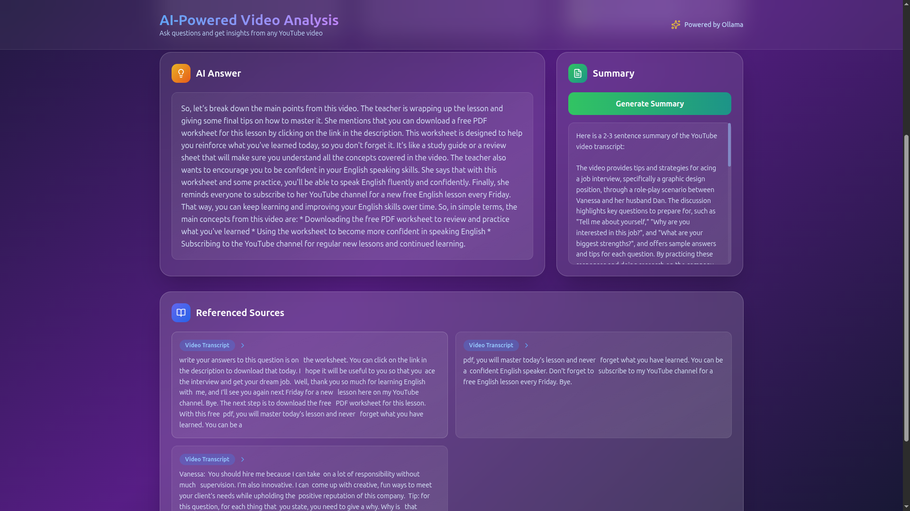

# YT-AI-QA: YouTube Video Analysis with AI

A powerful full-stack application that uses AI (via Ollama) to analyze YouTube videos. It can generate summaries, answer questions based on video content, and provide timestamped highlights.




## 🚀 Features

*   **Video Processing**: Downloads transcript and metadata from any YouTube URL.
*   **AI Summarization**: Generates concise summaries and key highlights with timestamps.
*   **Q&A Chat**: Ask questions about the video content and get answers with source references.
*   **RAG Architecture**: Uses Retrieval-Augmented Generation to ground answers in the video transcript.
*   **Local AI**: Completely private and free using local LLMs via Ollama.
*   **Modern UI**: Sleek, dark-themed interface built with React and Tailwind CSS.

## 🛠 Tech Stack

### Backend
*   **Framework**: FastAPI (Python)
*   **Architecture**: MVC (Models, Views/Controllers, Services)
*   **AI/ML**: LangChain, Ollama (LLM & Embeddings), FAISS (Vector Store)
*   **Utils**: YouTube Transcript API

### Frontend
*   **Framework**: React.js
*   **Styling**: Tailwind CSS
*   **Components**: Lucide React Icons

## 📋 Prerequisites

1.  **Docker & Docker Compose** (Recommended)
2.  **Ollama**: Installed and running locally.
    *   Pull the required models:
        ```bash
        ollama pull llama3
        ollama pull nomic-embed-text
        ```

## 🐳 Running with Docker (Recommended)

1.  **Clone the repository**
2.  **Ensure Ollama is running** on your host machine.
3.  **Run Docker Compose**:
    ```bash
    docker-compose up --build
    ```
4.  **Access the App**:
    *   Frontend: `http://localhost:3000`
    *   Backend API: `http://localhost:8001/docs`

## 💻 Manual Installation

### Backend Setup

1.  Navigate to `server/`:
    ```bash
    cd server
    ```
2.  Create virtual environment:
    ```bash
    python -m venv venv
    source venv/bin/activate  # Windows: venv\Scripts\activate
    ```
3.  Install dependencies:
    ```bash
    pip install -r requirements.txt
    ```
4.  Configure Environment:
    Create a `.env` file in `server/` (optional, defaults provided):
    ```env
    OLLAMA_BASE_URL=http://localhost:11434
    OLLAMA_MODEL=llama3
    OLLAMA_EMBEDDING_MODEL=nomic-embed-text
    ```
5.  Run Server:
    ```bash
    python main.py
    ```

### Frontend Setup

1.  Navigate to `client/`:
    ```bash
    cd client
    ```
2.  Install dependencies:
    ```bash
    npm install
    ```
3.  Run Client:
    ```bash
    npm start
    ```
    Access at `http://localhost:3000`.

## 📂 Project Structure

```
YT-AI-QA/
├── client/                 # React Frontend
│   ├── src/
│   │   ├── components/     # UI Components (VideoCard, GlassCard, etc.)
│   │   ├── services/       # API integration
│   │   └── App.js          # Main Application Logic
│   └── Dockerfile
├── server/                 # FastAPI Backend
│   ├── app/
│   │   ├── controllers/    # API Routes
│   │   ├── models/         # Pydantic Schemas
│   │   ├── services/       # Business Logic (Chat, Video, Summary)
│   │   └── utils/          # Helper functions
│   ├── main.py             # Entry point
│   ├── requirements.txt
│   └── Dockerfile
├── docker-compose.yml
└── README.md
```

## 🤝 Contributing

Contributions are welcome! Please feel free to submit a Pull Request.

## 📝 License

This project is open-source and available under the simple, permissive MIT License.
